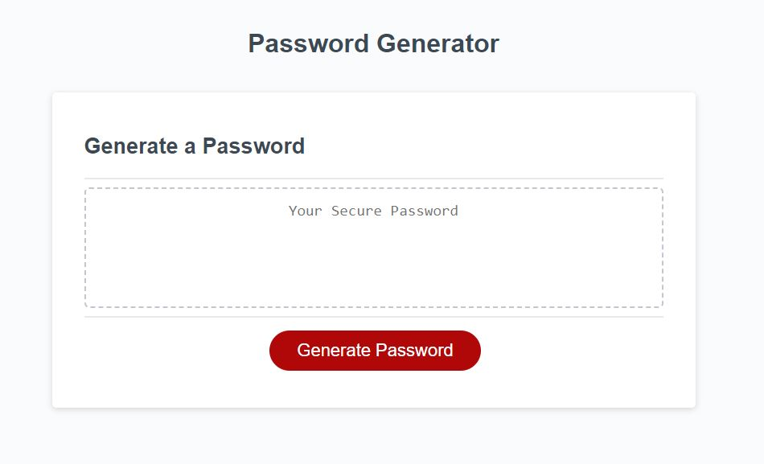

# Password Generator

## Description

I want an application that an employee can use to generate a random password based on criteria they've selected. This app will run in the browser, and features dynamically updated HTML and CSS powered by JavaScript code. It has a clean and polished user interface that is responsive, ensuring that it adapts to multiple screen sizes. With it's deployment, I've learned a number of skills including:

### Javascript:

- Operators
- Control flow
- Objects
- Arrays
- Functions

## Table of Contents (Optional)

If your README is long, add a table of contents to make it easy for users to find what they need.

- [Installation](#installation)
- [Usage](#usage)
- [Badges](#badges)
- [How_to_Contribute](#how_to_contribute)
- [Credits](#credits)
- [License](#license)

## Installation

No installation needed.

## Usage

The website can be found at: https://arishorts.github.io/passwordgenerator/

Click 'Generate Password' and follow the instructions. 

## Badges

## How_to_Contribute

If you would like to contribute, refer to the [Contributor Covenant](https://www.contributor-covenant.org/)

## Credits

- Mosh Hamedani: https://github.com/mosh-hamedani
- Contact Me Page: https://codewithmosh.com/

## License

MIT License https://choosealicense.com/licenses/mit/

---

© 2022 Ariel Schwartz LLC. Confidential and Proprietary. All Rights Reserved.
